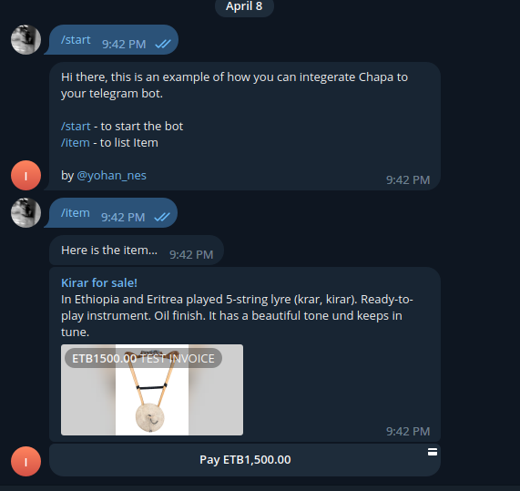
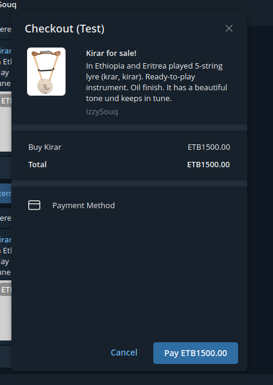
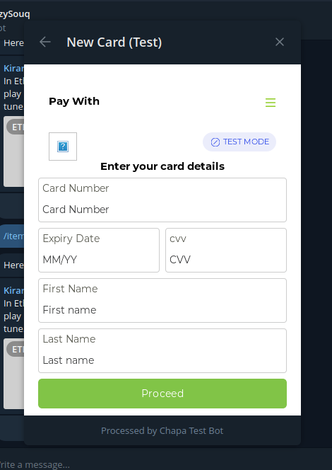

# ChapaTelegramJs

This guide provides instructions on how to create a Telegram bot with payment capability. It will walk you through the steps of setting up a Telegram bot, connecting it to a payment gateway, and integrating it into your existing Telegram chatbot. 

## Prerequisites 

Before you begin, you should have the following: 
- A Telegram account 
- A payment chapa account 
- Basic knowledge of programming languages such as JavaScript and Python 

## Step 1: Create a Telegram Bot 
The first step is to create a Telegram bot. To do this, open the Telegram app and search for “@BotFather” in the search bar. Once you find it, click on it and start a conversation with BotFather. Then type in “/newbot” to create a new bot. You will then be asked to provide a name for your bot and an username for it. After that, BotFather will provide you with an API token which you will need later on when setting up your bot.  

## Step 2: Connect Your Bot to a Payment Gateway 
Once your bot is created, you need to connect it to a payment gateway so that users can make payments through your bot. you can see how to do that [here.](https://support.chapa.co/knowledge-base/19-how-to-integrate-telegram-bot-with-chapa)

## Note
Don't forget to provide the **BOT_TOKEN** and **CHAPA_TOKEN** in your .env or enviroment variables!

## Screenshots

